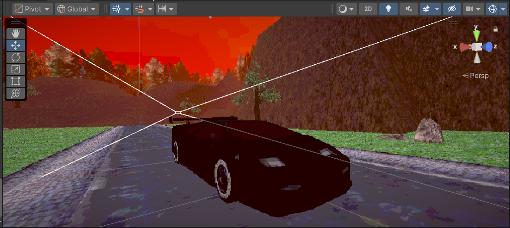

# RaceX 🚗

A small hobby project made in Unity featuring a basic car controller and a low-poly PS1-style city environment.  
The main goal of this project was to learn vehicle physics, environment design, and retro rendering effects.

---

## 🎮 Features
- Drivable car using Wheel Colliders
- Custom car controller with steering, braking, and smoke particles
- Play button to start driving
- Reset system to restart the game
- Low-poly PS1-style environment
- Retro post-processing shader
- Engine and ambient sound effects

---

## 🕹 Controls
| Key | Action |
|-----|--------|
| W / Up Arrow | Accelerate |
| S / Down Arrow | Brake / Reverse |
| A / Left Arrow | Steer Left |
| D / Right Arrow | Steer Right |
| R | Reset scene |
| Mouse | Click Play button |

---

## 🛠 Built With
- Unity 2022.3 LTS
- URP (Universal Render Pipeline)
- C#
- Retro PS1 shader pack

---

## 🎯 Goal of the Project
This project was created for learning purposes:
- Car physics
- Terrain & environment design
- Post-processing & shaders
- UI systems
- Audio integration

---

## 🔍 Preview

This game features a low-poly PS1-inspired city environment with a drivable car and retro visual effects.

### Dev Preview

---

## 📚 References

The following resources and tutorials were used as learning material and inspiration during development:

### YouTube Tutorials

1. Car Controller & Wheel Collider Setup  
   https://youtu.be/YyFx5HDbgSU?si=BTUYjqB_y3jAyaA_

2. City / Environment Building in Unity  
   https://youtu.be/hSe8vnKeOK8?si=-AdF-SBJddbkNU1X

3. PS1 / Retro Visual Style in Unity  
   https://youtu.be/gEwNHUDc8uE?si=Ln9QU56E6TGyeI_-

4. UI & Play Button / Camera Setup  
   https://youtu.be/AzdpRKtkFTE?si=pYCzmg5t6YNWqzT-

### Unity Documentation

5. Unity Documentation – Wheel Colliders  
   https://docs.unity3d.com/Manual/class-WheelCollider.html

6. Unity Documentation – Rigidbody Physics  
   https://docs.unity3d.com/Manual/class-Rigidbody.html

7. Unity Documentation – Terrain System  
   https://docs.unity3d.com/Manual/script-Terrain.html

8. Unity UI System Documentation  
   https://docs.unity3d.com/Manual/UISystem.html

9. Unity Audio System Documentation  
   https://docs.unity3d.com/Manual/Audio.html

 

👨‍💻 **Developed by** – @Arijit2175